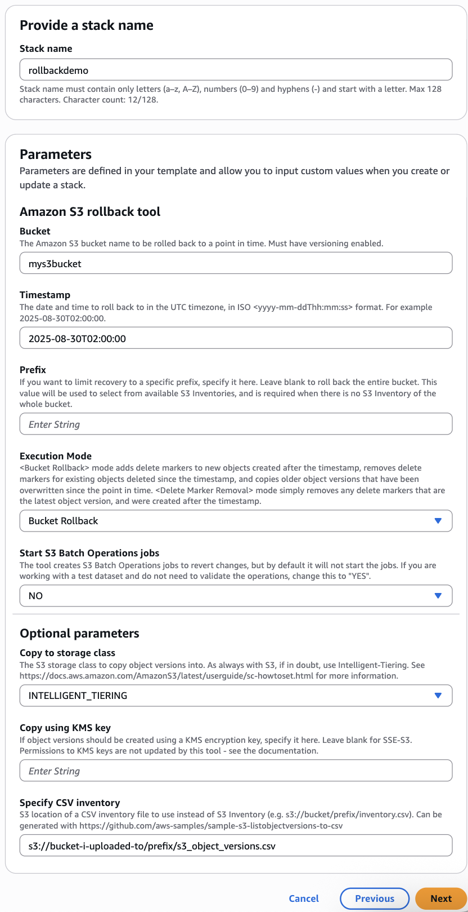
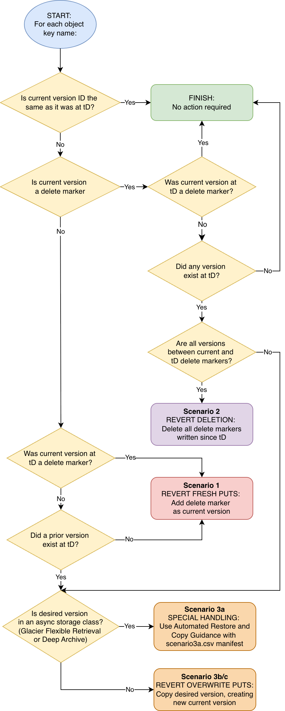

# Guidance for rolling back changes to datasets in Amazon S3

#### Within-bucket recovery using S3 Versioning, to a specified point-in-time, at scale.

>  **Disclaimer:** Code is provided as-is, to demonstrate a concept or workflow to AWS customers. You should ensure it meets your requirements, and carefully review the S3 Batch Operations manifests and tasks before running any jobs against non-test data.

## Table of Contents

- [Overview](#overview)
  - [Cost](#cost)
- [Prerequisites](#prerequisites)
- [Deploying and Running the Guidance](#deploying-and-running-the-guidance)
- [Rolling back changes at scale](#rolling-back-changes-at-scale)
- [Scenarios covered](#scenarios-covered)
  - [Bucket Rollback mode](#bucket-rollback-mode)
  - [Delete Marker Removal mode](#delete-marker-removal-mode)
- [Deployment workflow](#deployment-workflow)
  - [Bucket Rollback mode](#bucket-rollback-mode-1)
  - [Delete Marker Removal mode](#delete-marker-removal-mode-1)
- [Deployment Validation](#deployment-validation)
- [Creating a real-time inventory using the ListObjectVersions API](#creating-a-real-time-inventory-using-the-listobjectversions-api)
- [Simple demo](#simple-demo)
- [Ensuring recoverability](#ensuring-recoverability)
- [KMS permissions](#kms-permissions)
- [AWS Lambda concurrency reservations](#aws-lambda-concurrency-reservations)
- [FAQs](#faqs)
- [Cleanup](#cleanup)
- [Tenets](#tenets)
- [Additional resources](#additional-resources)
- [Revisions](#revisions)
- [Notices](#notices)
- [Authors](#authors)

## Overview
If you want to revert lots of changes to a dataset in Amazon S3, as quickly as possible, this tool is for you. It can detect and revert 10 million changes, in a bucket containing 10 billion objects, in under 1 hour. Or 100 million changes in under 5 hours.

It can also revert thousands of changes in a smaller bucket (up to millions of objects) in under 15 minutes end-to-end, including real-time inventory creation.

 Unlike other solutions, it does not require anything to be in place prior to the undesired event, other then [S3 Versioning](https://docs.aws.amazon.com/AmazonS3/latest/userguide/Versioning.html). See [Prerequisites](#prerequisites).

[Watch the demo here:](https://www.youtube.com/watch?v=2XR2trZvv7w) 

Undesired ‘soft DELETE’ (such as from [S3 Lifecycle expiry](https://docs.aws.amazon.com/AmazonS3/latest/userguide/lifecycle-expire-general-considerations.html)), ‘overwrite PUT’ and ‘non-overwrite PUT’ operations are all in scope - **you choose which of these to revert**. Changes to storage class (by [S3 Lifecycle](https://docs.aws.amazon.com/AmazonS3/latest/userguide/lifecycle-transition-general-considerations.html)) or to [object tags](https://docs.aws.amazon.com/AmazonS3/latest/userguide/object-tagging.html) are not in scope, as these do not create new object versions.

The tool will not delete any data - it works by adding and removing delete markers, and copying object versions where necessary, to  revert a dataset to an earlier time with the fewest possible operations.

> In 'Delete Marker Removal' mode, it will simply remove  delete markers placed after the specified time, down to the next regular object version, from objects where a delete marker is the current version. 

### Cost

You are responsible for the cost of the AWS services used while running this Guidance. 

For example, as of 2025-10-31, if you use this tool against an entire bucket in the US East (N. Virginia) Region containing 1 billion objects and with an existing Amazon S3 Inventory, to roll back 1 million non-overwrite PUTs, 1 million overwrite PUTs (of objects in Standard or Intelligent-Tiering classes`*`) *and* 1 million DELETEs since the desired point-in-time, **the total cost would be approximately $11**, detailed in the following table: 

| AWS service | Dimensions | Cost [USD] |
|-------------|------------|------------|
| [Amazon Athena](https://aws.amazon.com/athena/pricing/) | Data scanned | $1 |
| [Amazon S3](https://aws.amazon.com/s3/pricing/) | COPY requests | $5 |
| [Amazon S3 Batch Operations](https://aws.amazon.com/s3/pricing/) | Jobs and objects processed | $4 |
| [AWS Lambda](https://aws.amazon.com/lambda/pricing/) | Compute time and requests | $1 |

- `*` These S3 storage classes do not incur a per-GB retrieval charge when copied. 
- Additional storage charges for copies are not included in the above estimates.
- Athena charges can be expected to scale with objects in the inventory. 
- Following the [simple demo](#simple-demo) costs $1. 
- In testing, deleting 100 million delete markers incurred $36 in Lambda charges. S3 DELETE operations are not charged.

## Prerequisites

1. [S3 Versioning](https://docs.aws.amazon.com/AmazonS3/latest/userguide/Versioning.html) must be enabled on your Amazon S3 bucket.

2. To return the state of a dataset to an earlier time, this tool exposes or copies desired versions of objects. **These desired versions must still exist**. See the section [Ensuring recoverability](#ensuring-recoverability) for more information.

3. A current inventory of the bucket is required. This can be provided manually (see the section [Creating a real-time inventory using the ListObjectVersions API](#creating-a-real-time-inventory-using-the-listobjectversions-api)), or the tool can detect and use an existing [S3 Inventory](https://docs.aws.amazon.com/AmazonS3/latest/userguide/storage-inventory.html). Soon it will also support [S3 Metadata live inventory tables](https://docs.aws.amazon.com/AmazonS3/latest/userguide/metadata-tables-overview.html).
     
    - S3 Inventory reports are supported in [Parquet or Apache ORC](https://docs.aws.amazon.com/athena/latest/ug/columnar-storage.html) format, when including all versions as well as all [additional metadata](https://docs.aws.amazon.com/AmazonS3/latest/userguide/configure-inventory.html#configure-inventory-console). They must not be stored with [KMS encryption](https://docs.aws.amazon.com/AmazonS3/latest/userguide/UsingKMSEncryption.html). See [Deployment workflow](#deployment-workflow) for additional detail.

4. **The operations you want to roll back must be included in the inventory**. S3 Inventory reports are delivered daily (or weekly) and are eventually consistent and might not include recently added or deleted objects. This can add more than a day to the start of your recovery time. 

>  Note: [S3 Metadata live inventory tables](https://aws.amazon.com/blogs/aws/amazon-s3-metadata-now-supports-metadata-for-all-your-s3-objects/) provides up-to-date inventories of your buckets, at any scale. Support for these is coming soon.

## Deploying and Running the Guidance

Before reverting changes, you should prevent further changes taking place, for example with an update to your [bucket policy](https://docs.aws.amazon.com/AmazonS3/latest/userguide/bucket-policies.html) to deny PUT and DELETE operations (other than by roles created by this tool). You should also [temporarily disable any lifecycle expiry rules](https://docs.aws.amazon.com/AmazonS3/latest/userguide/lifecycle-configuration-examples.html#lifecycle-config-conceptual-ex2) to prevent objects being deleted during recovery. Then deploy the [CloudFormation template](s3-rollback.yaml) in the same AWS Region as the S3 bucket you want to roll back. During deployment, specify:

1. **Bucket**: The name of the bucket to roll back.
2. **TimeStamp**: The date and time to roll back to *in the UTC timezone*, in ISO `yyyy-mm-ddThh:mm:ss` format. For example: `2025-08-30T02:00:00`.
3. **Prefix**: If you want to limit recovery to a specific prefix, specify it here,  or leave blank to roll back the entire bucket. This will be used to select from available S3 Inventories, and is required if S3 Inventory is being used, unless there is an inventory report with the whole bucket in scope.
4. **Execution Mode**: 
    - **Bucket Rollback** is the default mode that creates S3 Batch Operations jobs to revert all changes in the bucket. This mode adds delete markers to new objects created after the timestamp, removes delete markers for existing objects deleted since the timestamp, and copies older object versions that have been overwritten since the point in time.
    - **Delete Marker Removal** mode simply removes delete markers placed after the timestamp, from objects where a delete marker is the current version. It will recover all objects that have been soft-deleted after the timestamp, including objects written or overwritten since the timestamp, back to their most recent version. The parameters **Copy to storage class** and **Copy using KMS key** are not used in this mode.
4. **Start S3 Batch Operations jobs**: The tool creates one or more S3 Batch Operations jobs to revert changes, but by default it will *not* start them. If you are working with a test dataset and do not need to validate the operations, change this to `Yes`.
5. **Copy to storage class**: The Amazon S3 storage class to copy object versions into. [If in doubt, use the Intelligent-Tiering storage class](https://catalog.workshops.aws/awscff/en-US/playbooks/storage/s3/2-choosing-storage-class). See [the documentation](https://docs.aws.amazon.com/AmazonS3/latest/userguide/sc-howtoset.html) for more information.
6. **Copy using KMS key (optional)**: If object versions should be created using a KMS encryption key, specify it here. Leave blank for bucket default. *Permissions to KMS keys are not updated by this tool - see the* [**KMS permissions**](#kms-permissions) *section.*
7. **Specify CSV inventory (optional)**: The S3 location of a CSV containing a current inventory of the bucket. This optional field allows you to provide a list of object versions, instead of using [S3 Inventory](https://docs.aws.amazon.com/AmazonS3/latest/userguide/storage-inventory.html). See the section [Creating a real-time inventory using the ListObjectVersions API](#creating-a-real-time-inventory-using-the-listobjectversions-api).

<strong>Expand this section for detailed instructions for deploying the CloudFormation template.</strong>

1. Download the [s3-rollback.yaml](s3-rollback.yaml) file from GitHub to your computer.
2. In the AWS Management Console, in the same region as your S3 bucket, find and select **CloudFormation**.
3. Choose **Create stack - With new resources (standard)**
4. For **Template Source**, choose, **Upload a template file**, **Choose file**, and select the `s3-rollback.yaml` file you downloaded. Choose **Next**. 
5. Enter a name for the stack. This must be unique for your account and region. Enter and choose parameters as described above and in the [simple demo](#simple-demo) below. Choose **Next**. 
6. Scroll to the end of the **Configure stack options** screen, check the box **I acknowledge that AWS CloudFormation might create IAM resources**, and choose **Next**. 
7. Scroll to the end of the **Configure stack options** screen and choose **Submit**.

1. Once the CloudFormation deployment is complete, review the [S3 Batch Operations jobs](https://docs.aws.amazon.com/AmazonS3/latest/userguide/batch-ops-managing-jobs.html) and their manifests using the Amazon S3 Console. 

2. If you are working in a production account, review the section on [AWS Lambda concurrency reservations](#aws-lambda-concurrency-reservations) and make any necessary changes.

3. If using KMS encryption, ensure the roles created by this tool have the necessary permissions before running the jobs (see [KMS permissions](#kms-permissions)).

**CAUTION: [S3 Versioning](https://docs.aws.amazon.com/AmazonS3/latest/userguide/Versioning.html) must be enabled when the Batch Operations Jobs are run. The tool will check that versioning is enabled on your bucket during deployment, but data loss can occur if versioning is suspended prior to the jobs being run.**

4. When you are ready, **run the desired S3 Batch Operations job(s).**

> There may be object versions that need to be copied to complete the recovery, but are in an asynchronous [S3 storage class](https://aws.amazon.com/s3/storage-classes/) (i.e. Glacier Flexible Retrieval or Glacier Deep Archive). This tool will not retrieve and copy these, but will output their details in a CSV manifest `scenario3a.csv`, in the S3 path referenced in the `Manifests` output, that can be used with the solution [**Guidance for Automated Restore and Copy for Amazon S3 Glacier Objects**](https://github.com/aws-solutions-library-samples/guidance-for-automated-restore-and-copy-for-amazon-s3-glacier-objects).

When you no longer need the manifests and other artifacts created by the tool, see the [Cleaning up](#cleaning-up) section.

## Rolling back changes at scale   

Users can [see the version history of a single object key in the S3 console](https://docs.aws.amazon.com/AmazonS3/latest/userguide/list-obj-version-enabled-bucket.html), and reverting a single object to an earlier version is as simple as [making a copy of the desired version to the same object key name](https://docs.aws.amazon.com/AmazonS3/latest/userguide/RestoringPreviousVersions.html), or [deleting a delete marker](https://docs.aws.amazon.com/AmazonS3/latest/userguide/ManagingDelMarkers.html). If an undesired new object has been placed (i.e. a ‘non-overwrite PUT’, not an overwrite of an existing object), it can have a delete marker placed on it with a DELETE operation.

This solution enables restoration at scale, finding changes within buckets containing billions of objects in minutes (using [Amazon Athena](https://aws.amazon.com/athena/)). It then determines the most efficient operations needed to revert those changes, and creates [S3 Batch Operations](https://aws.amazon.com/s3/features/batch-operations/) jobs to enact them. *By default, these jobs are not started automatically*. Users should review the jobs and their manifests to ensure the rollback operations are desired, before proceeding to run the jobs. The jobs can be found in the S3 Batch Operations console, or the CloudFormation output.

If you prefer to copy your dataset into a new bucket, as it was at a point in time, refer to [**Access a point in time with Amazon S3 Object Lambda**](https://aws.amazon.com/blogs/storage/access-a-point-in-time-with-amazon-s3-object-Lambda/) - a complimentary solution which can also provide snapshot-like read-only access without copying or changing any of your objects. Alternatively, consider the third-party software [rclone](https://rclone.org/) with the [`--s3-version-at`](https://rclone.org/s3/#s3-version-at) parameter.

## Scenarios covered

Scenarios differ depending on the selected mode. For each object key (name) in scope of the prefix filter:

### Bucket Rollback mode

1. **Revert ‘non-overwrite PUTs’:** At the desired point in time (tD), there was either no object with this name, or the current version was a delete marker. Since tD, a new object has been written (and potentially overwritten by further versions). The current version of the object is not a delete marker. 
    - **Action: Add a delete marker as the current version.**
2. **Revert DELETE operations:** At tD, a regular object (not a delete marker) was current. Since tD there has been at least one DELETE operation, but no regular objects have been PUT to the key. 
    - **Action: Delete all delete markers written since tD.**
3. **Revert ‘overwrite PUTs’:** At tD, a regular object (not a delete marker) was current. Since tD, there has been at least one PUT to the same key. 
    - **Action: Copy the desired version, creating a new current version.**
    - **Exception:** If the the desired version is in an an asynchronous S3 storage class (Glacier Flexible Retrieval or Glacier Deep Archive), include this in the `scenario3a.csv` manifest. You can then use [**Guidance for Automated Restore and Copy for Amazon S3 Glacier Objects**](https://github.com/aws-solutions-library-samples/guidance-for-automated-restore-and-copy-for-amazon-s3-glacier-objects) to retrieve those object versions and copy them in place.
    - **Note:** In this scenario you may prefer to permanently delete the newer object versions. Due to the potential for data loss, the tool does *not* include this capability.

### Delete Marker Removal mode

4. **Revert *all* DELETE operations since tD:** The current version of the object is a delete marker. 
    - **Action: Delete all delete markers written since tD.** In the event of an object version having been placed since tD, only delete markers written after the latest object version will be deleted.

## Deployment workflow

The tool requires an inventory of the bucket or prefix in scope. If none is available, the deployment will fail.

* If the **Specify CSV inventory** CloudFormation stack parameter has an entry, the tool will read it from the specified S3 location. If it cannot read or process this file, the deployment will fail.
* Otherwise, the tool will look at the S3 Inventory configuration of the selected bucket. It evaluates the available inventories, and will use the latest S3 Inventory report that is in [Parquet or Apache ORC](https://docs.aws.amazon.com/athena/latest/ug/columnar-storage.html) format and includes all versions as well as all [additional metadata](https://docs.aws.amazon.com/AmazonS3/latest/userguide/configure-inventory.html#configure-inventory-console). If a prefix has been specified in the CloudFormation deployment, the tool will prioritize inventories matching or containing the specified prefix. If no prefix is specified, there must be a valid S3 Inventory configuration containing all objects in the bucket, or the deployment will fail.

>  Note: [S3 Metadata live inventory tables](https://aws.amazon.com/blogs/aws/amazon-s3-metadata-now-supports-metadata-for-all-your-s3-objects/) provides up-to-date inventories of your buckets, at any scale. Support for these is coming soon.

The CloudFormation template creates the following resources:

* A temporary S3 bucket to store Athena output, associated [AWS Glue database](https://docs.aws.amazon.com/glue/latest/dg/define-database.html), Athena [workgroup](https://docs.aws.amazon.com/athena/latest/ug/workgroups-create-update-delete.html) and [tables](https://docs.aws.amazon.com/athena/latest/ug/creating-tables.html), plus S3 Batch Operations manifests and reports.
   - By default, new S3 buckets have [Block Public Access](https://aws.amazon.com/s3/features/block-public-access/) enabled and [new objects are encrypted at rest with SSE-S3](https://docs.aws.amazon.com/AmazonS3/latest/userguide/default-encryption-faq.html).
* Lambda functions to create the above resources, check versioning is enabled, determine which inventory to use, orchestrate Athena queries, create manifests in the correct formats, create S3 Batch Operations jobs, and clean up the temporary S3 bucket when the CloudFormation stack is deleted.
* IAM roles for use by the tool.

The tool outputs manifest files for S3 Batch Operations jobs, in the S3 path referenced in the `Manifests` output, depending on the mode selected:

### Bucket Rollback mode

* **Scenario 1**:  Where all versions of a key have last_modified after the desired Point In Time (tD), or the current version at tD was a delete marker, and current version is not a delete marker. **Add a delete marker.**
* **Scenario 2:**  Keys where there are only delete markers (no new objects) after tD. **These delete markers will be deleted.**
    * `scenario2-undo.csv` will also be created so that these can be recreated if needed. See [FAQ #3](#faqs).
* **Scenarios 3a, b and c:** Keys where there was an object (not a delete marker) at the tD, and there is current version newer than at tD. Excludes keys covered by scenarios 1 and 2. **The desired VersionID will be copied to the same key, making it the current version.**
    * **3a:** Desired VersionID is in Glacier Flexible Retreival or Deep Archive class and needs to be restored from async. **This tool will not copy these objects**, but output its details in the `scenario3a.csv` manifest that can be used with [**Guidance for Automated Restore and Copy for Amazon S3 Glacier Objects**](https://github.com/aws-solutions-library-samples/guidance-for-automated-restore-and-copy-for-amazon-s3-glacier-objects).
        * Note that as ListObjectVersions and S3 Metadata don't report Intelligent Tiering tier, objects versions that need to be retrieved before being copied from the *opt-in* asynchronous Archive and Deep Archive tiers won’t be included here unless an S3 Inventory source is used. Instead they will be included in scenario 3b or 3c, and an attempt made to copy them. These copy attempts will fail with `403: InvalidObjectState` 
    * **3b:** Desired VersionID <= 5 GiB. These objects will copied with the CopyObject API, with an S3 Batch Operations Copy job.
    * **3c:** Desired VersionID > 5 GiB. These objects require special handling. A separate S3 Batch Operations Lambda job will perform these copies, reusing code from the solution at https://aws.amazon.com/blogs/storage/copying-objects-greater-than-5-gb-with-amazon-s3-batch-operations/ .
            

**You are in control of the above operations. For example, if you don't want to revert non-overwrite PUTs, don't run the `Scenario 1` Batch Operations job.**

The following flow diagram illustrates the Bucket Rollback mode workflow:

### Delete Marker Removal mode

* **Scenario 4**:  At tD, a regular object (not a delete marker) was current, and now the current version of the object is a delete marker. **All delete markers written since tD will be deleted**. In the event of an object version having been placed since tD, only delete markers written after the latest object version will be deleted.

## Deployment Validation

All S3 Batch Operations jobs created by this tool create completion reports, including both success and failure for each task. If you find you have some failures and wish to manually address these (as opposed to re-running the tool), follow the [instructions in this article](https://repost.aws/articles/ARq3WkGPYmSmiT3xC8Me_mvA/querying-s3-batch-operations-completion-reports-with-amazon-athena) to find the failures.

## Creating a real-time inventory using the ListObjectVersions API

The S3 rollback tool has been designed to operate with up to 10 billion objects in scope. At this scale, S3 Inventory or S3 Metadata inventory tables are necessary in order to obtain a listing of all the object versions and their details.

If you have up to 100 million objects in your bucket, or are looking to perform rapid iterative testing of this tool, you may prefer to list all the objects in scope rather than use S3 Inventory or S3 Metadata. The example script provided at https://github.com/aws-samples/sample-s3-listobjectversions-to-csv/ uses [list_object_versions with boto3](https://boto3.amazonaws.com/v1/documentation/api/latest/reference/services/s3/client/list_object_versions.html) to output all object versions in a bucket (and optionally prefix), into a CSV format that can be used with this tool (with the following headers: `bucket_name, key_name, version_id, is_latest, delete_marker, size, last_modified, storage_class, e_tag`). The example script lists 1 million object versions in 5 minutes (on a t2.micro instance), and 50 million in approximately 5 hours.

Copy your output CSV into another S3 bucket in the region you are working in. You can do this using the [AWS CLI](https://aws.amazon.com/cli/) with `aws s3 cp s3_object_versions.csv s3://my-s3-bucket/prefix/name.csv` - note the object name must end `.csv`.

>  Note: [S3 Metadata live inventory tables](https://aws.amazon.com/blogs/aws/amazon-s3-metadata-now-supports-metadata-for-all-your-s3-objects/) provides up-to-date inventories of your buckets, at any scale. Support for these is coming soon.

## Simple demo

For a simple demonstration example, costing $0.75-$1.00 (for the three to four S3 Batch Operations jobs), perform the following:

1. Create a new S3 bucket for testing, with versioning enabled. Keep all other defaults.
2. Create text files `a` and `b`, and upload them to the new bucket. **This is your desired (good) state**. Note the time, adjusted to the UTC timezone.
   - The bucket will look like this in the console:
   
   

   - And like this with **Show versions** enabled:
   
   .png)

   - Disable **Show versions** before proceeding.

3. Delete object `a` (ensure this is done without **Show versions** enabled - you should be typing `delete` not `permanently delete`), overwrite object `b` (by editing the text file and then uploading it to the same key name), and write new object `c`. **This is your undesired state, that you want to roll back**.
   - The bucket will look like this in the console: 
   
   

   - And like this with **Show versions** enabled:
   
   .png)

4. Create a real-time inventory (see [Creating a real-time inventory using the ListObjectVersions API](#creating-a-real-time-inventory-using-the-listobjectversions-api)), and copy the output CSV into S3.
5. Deploy the [CloudFormation template](s3-rollback.yaml).
   - Enter the name of the test bucket you just created.
   - Enter a timestamp (in UTC) after step 2 but before step 3. In this example, it was `2025-08-22T11:01:00`.
   - Leave the default **Bucket Rollback** mode selected.
   - Set **Start S3 Batch Operations jobs** to `YES`.
   - Set **Specify CSV inventory** to the URI of the real-time CSV inventory object you uploaded.
   - **Create Stack**.
6. Observe the CloudFormation template deployment. When complete, observe the S3 Batch Operations jobs referenced in the output, and review their manifests. The whole process should complete in around 2 minutes.
   - The bucket will look like this in the console - back to your desired state: 
   
   

   - And like this with **Show versions** enabled:
   
   .png)

   - Note that the newest version of object `b` is a copy of the oldest version. 

## Ensuring recoverability

[Amazon S3](https://aws.amazon.com/s3/) is an object storage service with industry-leading scalability, data availability, security, performance, and 99.999999999% (11 9s) of data durability. [S3 Versioning](https://docs.aws.amazon.com/AmazonS3/latest/userguide/Versioning.html) protects against accidental deletions and overwrites by keeping multiple variants of an object in the same S3 bucket, and placing a [delete marker as the current version in response to simple DELETE requests](https://docs.aws.amazon.com/AmazonS3/latest/userguide/DeletingObjectVersions.html) (i.e. without specifying a VersionID). 

To return the state of a dataset to an earlier time, this tool exposes or copies desired versions of objects. **These desired versions must still exist**. Administrators can prevent the deletion of specific versions in Amazon S3 by denying use of the [DeleteObjectVersion](https://docs.aws.amazon.com/AmazonS3/latest/API/API_DeleteObject.html) and [PutLifeCycleConfiguration](https://docs.aws.amazon.com/AmazonS3/latest/API/API_PutBucketLifecycleConfiguration.html) APIs with [bucket policies](https://docs.aws.amazon.com/AmazonS3/latest/userguide/bucket-policies.html), [access point policies](https://docs.aws.amazon.com/AmazonS3/latest/userguide/access-points-policies.html), [service control policies (SCPs)](https://docs.aws.amazon.com/organizations/latest/userguide/orgs_manage_policies_scps.html), or [resource control policies (RCPs)](https://docs.aws.amazon.com/organizations/latest/userguide/orgs_manage_policies_rcps.html), and/or by using [S3 Object Lock](https://docs.aws.amazon.com/AmazonS3/latest/userguide/object-lock.html). For a complementary solution to assist with this, see [**Maintaining object immutability by automatically extending Amazon S3 Object Lock retention periods**](https://aws.amazon.com/blogs/storage/maintaining-object-immutability-by-automatically-extending-amazon-s3-object-lock-retention-periods/). You can also use [S3 Replication](https://docs.aws.amazon.com/AmazonS3/latest/userguide/replication.html) to make and maintain a copy of your data in another bucket (see [FAQ #9](#faqs)).

## KMS permissions

The roles created by this tool **will not have IAM or KMS permissions to any KMS keys**. If you have have objects in scope that are encrypted with KMS, or you have specified that the solution should use a KMS key when copying objects, or your bucket has default encryption set to a KMS key, you will need to update permissions before starting the Batch Operations copy jobs (Scenario 3). The ARNs that require permissions are shown in the `CopyRole3b` and `CopyRole3c` output of the CloudFormation stack.

Permissions required:
- KMS decrypt for object versions to be copied
- KMS encrypt for the key you selected copies to be encrypted with (or the bucket default)

KMS permissions are *not* required for the scenario 1 and 2 and 4 jobs, as DELETE operations do not encrypt or decrypt data.

## AWS Lambda concurrency reservations

**This tool does not assign [reserved concurrency](https://docs.aws.amazon.com/lambda/latest/dg/configuration-concurrency.html)** to the Lambda functions it creates, and may consume all the available [AWS Lambda concurrent execution quota](https://docs.aws.amazon.com/lambda/latest/dg/gettingstarted-limits.html#compute-and-storage). **If you have concerns about this, review the S3 Batch Operations tasks that use Lambda (scenarios 1, 2 and 3c), and [adjust the Lambda functions accordingly](https://docs.aws.amazon.com/lambda/latest/dg/configuration-concurrency.html#configuring-concurrency-reserved) before running the jobs**. We made this design decision because 1/ at the time the functions are created the tool does not know the number of objects (if any) in scope for the relevant scenarios, 2/ we don't know the Lambda concurrent execution quota, or how much it is appropriate to consume, and 3/ when a function has reserved concurrency, no other function can use that concurrency. Any reservation assigned by the tool would have been held until the CloudFormation stack was deleted.

The Lambda functions created by this tool (for use with S3 Batch Operations) have been tested with up to 1000 concurrent executions. Please see [Lambda quotas](https://docs.aws.amazon.com/lambda/latest/dg/gettingstarted-limits.html) in the AWS documentation.

## FAQs

1. What did I need to have in place prior to an event that I want to recover from, in order to use this tool?
    - S3 Versioning must have been enabled before the time of the event. Object versions cannot be recovered if they have since been permanently deleted (either directly or by a lifecycle rule). See [Prerequisites](#prerequisites).
    - If you don’t have an S3 Inventory from after the event, you will need to enable this and wait for it to create an inventory of your S3 bucket. Or you can LIST the contents of your bucket into a CSV - see [**Creating a real-time inventory using the ListObjectVersions API**](#creating-a-real-time-inventory-using-the-listobjectversions-api).
2. What about changes that took place after the inventory was created, or after the rollback process was started?
    - This tool will take the appropriate action to revert changes, based on the available inventory information at the time of deployment. The impact of a subsequent change depends on its nature, and whether it took place before or after the specific S3 Batch Operations job (created  by this rollback tool) took its action. However, in all cases, running the rollback tool *again*, with an inventory that includes new changes, will correctly revert the new changes. Note: If the new inventory includes copies made by this tool (scenario 3), those copies will be repeated as it isn't possible to tell from an inventory that the current object version's data is identical to the desired version.
3. I used this tool to roll back my bucket, and want to undo the changes. Can I do that?
    - Yes, provided you have not yet deleted the CloudFormation stack from the original deployment. 
    - For Bucket Rollback mode, This is a 2-step process:
      1. Once you have an inventory that includes the changes made by this tool, deploy the tool again in **Bucket Rollback** mode to roll back to the point in time just prior to the initial deployment. If you have S3 Metadata live inventory enabled, simply wait 15 minutes to ensure all changes have been written to the journal (`S3 Metadata support is coming soon`). 
      2. Once the above is complete, you need to re-create any delete markers removed by the original deployment, as the updated inventory has no knowledge of these. To do this, create an S3 Batch Operations job, choose the CSV manifest `scenario2_undo.csv` from the *original deployment*, leaving **Manifest includes version IDs** unchecked. Choose **Invoke AWS Lambda function** as the operation type, the function titled `<original stack name>-S3BatchOpsDeleteFunction-<unique-id>` (you can find this name in the **Resources** output of the deployment) and **Invocation schema version 2.0**. Run the job with the role titled `<original stack name>-S3BatchOpsExecutorRole--<unique-id>`.
    - For Remove Delete Markers mode, you need to re-create any delete markers removed by the original deployment. To do this, create an S3 Batch Operations job, choose the CSV manifest `scenario4_undo.csv` from the *original deployment*, leaving **Manifest includes version IDs** unchecked. Choose **Invoke AWS Lambda function** as the operation type, the function titled `<original stack name>-S3BatchOpsDeleteFunction-<unique-id>` (you can find this name in the **Resources** output of the deployment) and **Invocation schema version 2.0**. Run the job with the role titled `<original stack name>-S3BatchOpsExecutorRole--<unique-id>`.
4. What happens when I delete the CloudFormation stack?
    - Any S3 Batch Operations jobs not in COMPLETE state will be cancelled.
    - All created resources will be deleted, including the temporary S3 bucket.
5. I don’t want to delete delete markers, but instead copy the desired object version to the top of the version stack.
    - As this increases both cost and time, delete markers contain no data, and deletion of delete markers is reversible, we made the decision not to prioritize providing this as an option. We may consider adding this capability based on feedback - see [Issues](https://github.com/aws-samples/sample-s3-rollback-tool/issues).
6. I have [ACLs enabled](https://docs.aws.amazon.com/AmazonS3/latest/userguide/ensure-object-ownership.html) on my bucket, can I still use this tool?
    - Yes, however the copy operations carried out by this tool will overwrite the ownerID, which may cause access issues for the original uploading account.
7. I have objects in my bucket with `null` version IDs from when S3 Versioning was disabled or suspended. Will this tool still work?
    - Yes, the tool will correctly copy objects and delete delete markers that have a `null` version ID. Versioning must be enabled when this tool is deployed. When versioning is suspended, objects and delete markers are written with `null` version IDs, and will permanently and immediately overwrite any existing object with the same version ID.
8. I only want to remove delete markers, not any PUT operations. Is this tool still useful?
    - Yes:
        - To simply delete all delete markers placed after tD, select the dedicated **Remove Delete Markers** mode during deployment.
        - Or, if you only want to remove delete markers from objects that were present (with a current version that was not a delete marker) at tD, select the default **Bucket Rollback** mode, leave **Start S3 Batch Operations Jobs** as `FALSE`, and then only run the scenario 2 job. Note this will not act on keys where an object has been PUT after tD, as this falls under scenario 3.
9. Does this work with S3 Replication?
    - Yes. If you have used S3 Replication to make a copy of your data in another bucket, you could use this tool to revert either the source or destination bucket. Note that permanent delete operations (including of delete markers) are not replicated, and replication of new delete markers is [optional](https://docs.aws.amazon.com/AmazonS3/latest/userguide/delete-marker-replication.html).
    1. If you want to roll back both source and destination buckets:
        1. Ensure replication of delete markers is enabled in your replication rule.
        2. Roll back the source bucket to tD, running all Batch Operations jobs. The operations carried out by the Scenario 1 and 3 jobs will be replicated.
        3. Roll back the destination bucket to tD, running only the Scenario 2 job, as these operations will *not* have been replicated.
    2. If you only want to roll back the destination (for example, you are failing over to using the destination bucket):
        1. [Disable the replication rule](https://docs.aws.amazon.com/AmazonS3/latest/userguide/replication-add-config.html#replication-config-min-rule-config) to prevent further replication from source to destination.
        2. Using an inventory that includes all replicated changes, roll back the destination bucket to tD.

## Cleanup

As the tool is deployed once per use, it should be removed once the jobs are complete and the reports are no longer required.

To clean up, delete the CloudFormation stack. This will delete any CSV manifests generated by the tool, as well as all the resources it created.

## Tenets

* **Works at any scale**: Designed to support 10B object buckets with 1B changes. Efficiency is key to achieving this. Re-running with a new inventory (to catch up, or following failures/cancellations) will not repeat completed operations (where possible, see FAQ 2).
* **Fast at any scale:** Revert 1M changes in a 10B object bucket in under 1 hour, end to end, using S3 Inventory. Delete 100M delete markers in 3.5 hours (with 1000 concurrent lambda executions, and where S3 prefix partitioning permits). Revert a few thousand changes in a 1M object bucket in under 15 minutes, including real-time CSV inventory creation.
* **Do no harm:** Do not delete data (never regular object versions, only delete markers). S3 Batch Operations jobs are created but not started by default. Ensure S3 Versioning is enabled.
* **Flexible**: Use any inventory. Give users control of prefix and which operations to carry out. 
* **No assumptions**: Don’t assume which operations the user wants to run, which storage class to copy to, or encryption to use for copies. We can’t know what’s ‘correct’, so we ask.

## Additional resources

* [AWS CloudFormation product page](https://aws.amazon.com/cloudformation/)
* [Amazon S3 Batch Operations documentation](https://docs.aws.amazon.com/AmazonS3/latest/userguide/batch-ops.html)
* [AWS Lambda product page](https://aws.amazon.com/lambda/)
* [AWS Lambda Performance Guidelines](https://docs.aws.amazon.com/lambda/latest/operatorguide/perf-optimize.html)
* [Serverless Data Integration – AWS Glue – Amazon Web Services](https://aws.amazon.com/glue/)
* [Interactive SQL - Serverless Query Service - Amazon Athena - AWS](https://aws.amazon.com/athena/)
* [Amazon S3 Inventory](https://docs.aws.amazon.com/AmazonS3/latest/userguide/storage-inventory.html)
* [Amazon S3 Metadata tables](https://docs.aws.amazon.com/AmazonS3/latest/userguide/metadata-tables-overview.html)
* [Amazon S3 Tables](https://docs.aws.amazon.com/AmazonS3/latest/userguide/s3-tables.html)

## Revisions

- 2025-09-15 - Initial release
- 2025-10-31 
    - Added Remove Delete Marker mode
    - 4x improvement in Lambda function performance
    - updated readme.md to comply with new repository requirements.

## Notices

Customers are responsible for making their own independent assessment of the information in this Guidance. This Guidance: (a) is for informational purposes only, (b) represents AWS current product offerings and practices, which are subject to change without notice, and (c) does not create any commitments or assurances from AWS and its affiliates, suppliers or licensors. AWS products or services are provided “as is” without warranties, representations, or conditions of any kind, whether express or implied. AWS responsibilities and liabilities to its customers are controlled by AWS agreements, and this Guidance is not part of, nor does it modify, any agreement between AWS and its customers.

This library is licensed under the MIT-0 License. See the [LICENSE](LICENSE) file.

## Authors

* Ed Gummett, Senior Storage Specialist Solutions Architect, AWS. [Connect on LinkedIn.](https://www.linkedin.com/in/egummett/)
* Paul Gargan, Senior Solutions Architect, AWS.
* Tom Bailey, Senior Technical Account Manager, AWS. [Connect on LinkedIn.](https://www.linkedin.com/in/tom-bailey-1633866/)

